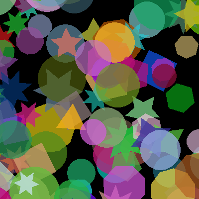

[](https://github.com/jbroutier/image-generator/actions/workflows/ci.yml)
[](https://github.com/jbroutier/image-generator)
[](https://github.com/jbroutier/image-generator/blob/main/LICENSE)
[](https://packagist.org/packages/jbroutier/image-generator)

# Image generator

Offline random placeholder image generator.

This is a rewrite of [standaniels/image-generator](https://github.com/standaniels/image-generator) which keeps the overall
package goal but adds many features, including:

- More output formats: AVIF (PHP 8.1+), BMP, GIF, JPEG, PNG, WBMP, WebP, XMB.
- More color options.
- More shape options.
- Transparent background support.
- No dependency on `ext-exif`.
- Full PHP 8.0+ compatibility.

## Basic example

```php
<?php

use ImageGenerator\Canvas;
use ImageGenerator\Color;
use ImageGenerator\Shape\Shape;

$canvas = Canvas::create(400, 400);

for ($i = 0; $i < 100; $i++) {
    $canvas->draw(Shape::random(), Color::random());
}

$canvas->render('output.png');
```

The generated image will look like this:



## Advanced examples

### Background color

It is possible to define the background color, to use a semi-transparent background or a totally transparent background.

```php
// Fully-transparent background
$canvas->enableTransparency();

// Semi-transparent light background.
$canvas->enableTransparency();
$canvas->fill(Color::create(236, 240, 241, 0.55));

// Fully-opaque dark background
$canvas->fill(Color::create(44, 62, 80, 1));
```

### Shapes

```php
// Circles only
$canvas->draw(Circle::random(), Color::random());

// Hexagons only
$canvas->draw(Polygon::random(['min_sides' => 6, 'max_sides' => 6]), Color::random());

// Stars with 5 to 7 points
$canvas->draw(Star::random(['min_points' => 5, 'max_points' => 7]), Color::random());
```

### Colors

```php
// Semi-transparent shade of blue
$canvas->draw(Shape::random(), Color::create(41, 128, 185, 0.65));

// Fully-opaque shade of green
$canvas->draw(Shape::random(), Color::create(39, 174, 96, 1));
```

### Shape size ratio

The size of shapes is automatically calculated based on the size of the canvas. However, it's possible to adjust the
size ratio to obtain smaller or larger shapes.

```php
// With random shapes
$shape = Shape::random([
    'circle' => [
        'min_ratio' => 0.0625,
        'max_ratio' => 0.125,
    ],
]);

// With a single shape
$shape = Shape::circle([
    'min_ratio' => 0.0625,
    'max_ratio' => 0.125,
]);
```

### Alpha range

It is possible to adjust the range of transparency or turn off transparency completely. A value of 0 corresponds to a
fully transparent color while a value of 1 corresponds to a fully opaque color.

```php
// Full alpha range
$color = Color::random([
    'min_alpha' => 0,
    'max_alpha' => 1
]);

// Fully-opaque colors
$color = Color::random([
    'min_alpha' => 1,
    'max_alpha' => 1
]);
```

### Output format

The default format is PNG but it is possible to choose another image format. Note that AVIF format support is only
available from PHP 8.1. Support for different image formats depends on how PHP was built and may vary depending on your
platform.

```php
$canvas->render('output.avif' , 'avif');
$canvas->render('output.bmp'  , 'bmp' );
$canvas->render('output.gif'  , 'webp');
$canvas->render('output.jpeg' , 'jpeg');
$canvas->render('output.png'  , 'png' );
$canvas->render('output.wbmp' , 'wbmp');
$canvas->render('output.webp' , 'webp');
$canvas->render('output.xbm'  , 'xbm' );
```

### Image quality

Some image formats allow you to adjust the image quality. Options are passed directly to the underlying render function.

```php
$canvas->render('output.avif', 'avif', 80, 5); // Quality: 80, Speed: 5
$canvas->render('output.bmp' , 'bmp' , true ); // Enable compression
$canvas->render('output.jpeg', 'jpeg', 90   ); // Quality: 90
$canvas->render('output.png' , 'png' , 9    ); // Compression level: 9
$canvas->render('output.webp', 'webp', 80   ); // Quality: 80
```
